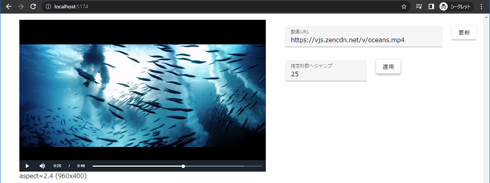

# vue-typescript-videojs-sample

Vue.js3 + TypeScript + video.js を組み合わせたサンプルです。
UIフレームワークにはVue3 系列でも使用できる Vuetify を使用しています。

## 動作イメージ

## 使用しているライブラリなど

- [Vue.js 3.2](https://ja.vuejs.org/)
- [Video.js](https://videojs.com/)
- [Vuetify](https://vuetifyjs.com/ja/)

## 紹介している機能

- 指定された URL / ファイルへの切り替えの例
- 指定された秒数へのジャンプ(シーク)の例
- 再生時間・総時間の表示の例

### 課題

再生時間・総時間の表示について、scoped css での実現ができていない点。
